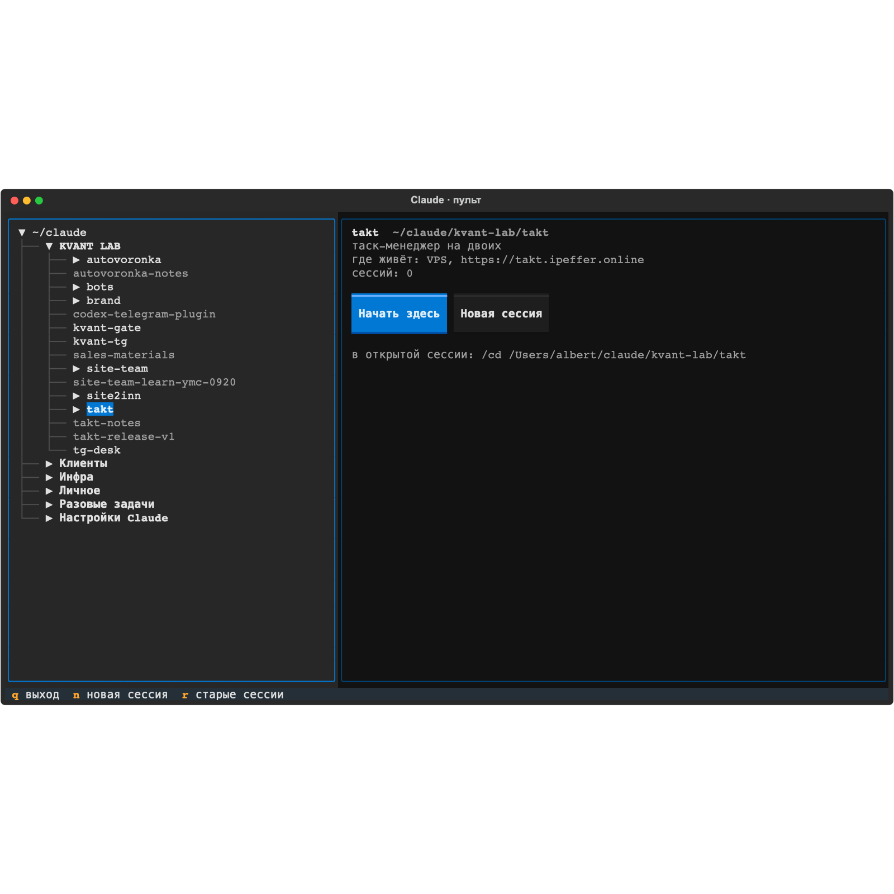

# Панель управления папками Claude

Окно в терминале, из которого Claude Code запускается сразу в нужной папке проекта.
Решает одну задачу: сессия должна рождаться у проекта, а не в домашней папке,
и для этого не нужно помнить пути.



## Что умеет

- Слева дерево рабочей папки `~/claude`: сегменты → проекты → части
  (рабочие копии `.claude/worktrees/*`, подпапки со своим `CLAUDE.md`).
  Проект с живой сессией отмечен точкой: синяя «работает», жёлтая «ждёт ответа».
- Справа карточка выбранного: описание и место размещения из таблиц `CLAUDE.md`,
  число сессий, имена последних.
- Кнопки и клавиши: **Продолжить** (Enter), **Новая сессия** (`n`, спросит направление,
  имя получится «проект · направление»), **Старые сессии** (`r`), список живых сессий
  (Enter подключает), `q`/Esc закрыть. Мышь работает.
- Список строится из дерева папок без отдельного конфига. Новый проект появляется сам.

## Установка

```sh
git clone git@github.com:Just-trying-to-make-something-cool/claude-panel.git ~/claude/claude-settings/claude-panel
~/claude/claude-settings/claude-panel/install.sh
```

Установщик создаёт `.venv` с Textual, ставит fzf через Homebrew для запасного режима
и кладёт команду `c` (и русскую `с`, чтобы раскладка не мешала) в `~/.local/bin`.
Нужны macOS, Python 3.12+, Claude Code 2.1.2xx+.

## Использование

```
c              открыть панель
c --list       таблица мест запуска текстом
c --fzf        запасной двухшаговый режим на fzf
c --dry ПАПКА [continue|new|resume] [имя]   показать команду запуска, не запуская
```

Внутри уже открытой сессии Claude тот же переезд в другую папку делает `/cd <путь>`.

## Откуда данные

| что | откуда |
|---|---|
| описание, где живёт | таблицы `\| папка \| что \| где \|` в `CLAUDE.md` родительской папки |
| сессий, последняя | `~/.claude/projects/<путь, где всё кроме букв и цифр заменено на ->/*.jsonl` |
| живые сессии | `claude agents --json` |
| «ждёт ответа» | `~/.claude/jobs/*/state.json` со `state: blocked` |

Формат этих файлов внутренний для Claude Code и может меняться; панель только читает.

## Устройство

```
panel/core.py   обход дерева, разбор таблиц, статистика, запуск (claude -c / -n / -r)
panel/tui.py    окно на Textual
bin/c           обёртка: окно из .venv, служебные флаги через core.py
tests/          unittest; окно тестируется безголово через Textual Pilot
```

Тесты: `.venv/bin/python -m unittest discover -s tests`.
Снимок окна: `app.save_screenshot('x.svg')` в тесте, затем `qlmanage -t -s 1600 -o . x.svg`.
